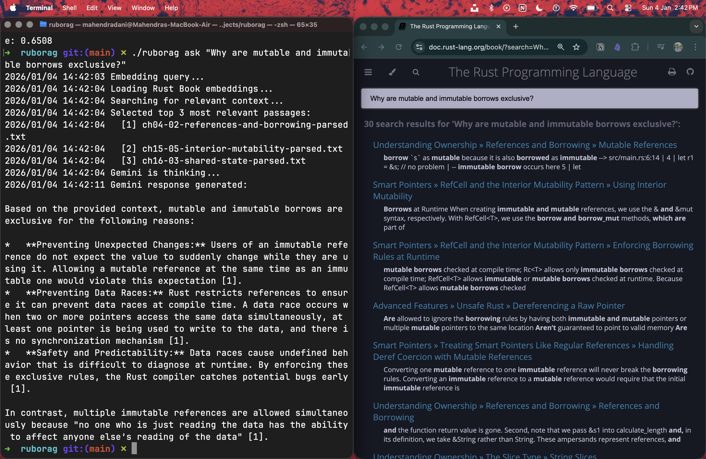

# ruborag

ruborag (The Rust Book RAG) is a **Retrieval-Augmented Generation (RAG)** CLI tool written in Go. It supports parsing, embedding, searching, and question-answering over a document corpus from  [The Rust Programming Language book](https://doc.rust-lang.org/book/).



# Features

1. Parse HTML files - strip tags, remove spaces and lines (`ruborag parse [--write --out-dir <dir>] <input_path>...`). 
2. Generate vector embeddings of one or more files write to local SQLite index database (`ruborag embed [-w|-c] <input_path>...`) 
3. Semantic search the corpus using cosine similarity to find most relevant chapters from the book. (`ruborag search <query>`)
4. Combine semantic search, RAG and Gemini to generate answers for queries.(`ruborag ask <question>`)

# Installation
Ensure that you've Go compiler installed. Clone the repository and build:
```bash
git clone https://github.com/MahendraDani/ruborag.git
cd ruborag
go build -o ruborag
```

# Usage
Run the following commands:

```bash
# Parse input files and strip HTML tags
./ruborag parse [file1] [file2]

# Create embeddings from a text file
./ruborag embed [file1]

# Search the corpus for a query
./ruborag search "What's shadowing in Rust?"

# Ask a question using RAG (answers from Rust book)
./ruborag ask "What's borrowing in Rust"

```

Each command performs a key step in building and querying a retrieval-augmented workflow. Use `-h` with any command to get help.

# Example Workflow
1. Parse documents — clean raw Rust book chapters.
2. Embed parsed text to vectors.
3. Search relevant sections for a query.
4. Ask an LLM to answer using retrieved context.

## Benchmarks

### ruborag parse
1. Unbuffered IO
```bash
go run main.go parse -w -u --out-dir=./corpus/parsed corpus/raw/*
```

2. Buffered IO
```bash
go run main.go parse -w --out-dir=./corpus/parsed corpus/raw/*
```

| IO strategy   | User time (s) | System time (s) | CPU usage | Total time (s) |
|--------------|---------------|-----------------|-----------|----------------|
| Unbuffered IO | 0.16          | 0.16            | 24%       | 1.282          |
| Buffered IO   | 0.09          | 0.12            | 56%       | 0.358          |

Buffered IO is ~3.5x faster than unbuffered IO.


